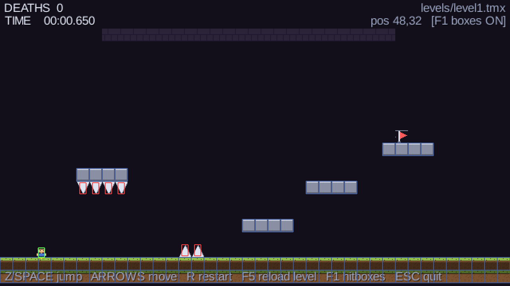
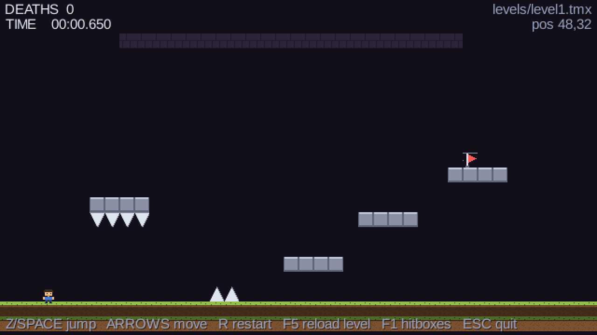

# PixelPeril

一款**精确平台跳跃游戏**（precision platformer），用 Java 21 + libGDX 从零实现引擎。
玩法参照 I Wanna 系一类高难度跳跃游戏的设计：一击即死、瞬时重试、判定精确到像素。
工程包含像素完美渲染、Tiled 关卡工作流，以及一套**不需要窗口和显卡**的
自动化物理自检。




仓库：<https://github.com/zzggsse/Precision-Platformer->

> 上图是 `F1` 调试视图：红色是尖刺判定框（比贴图窄）、绿色是玩家碰撞盒（比精灵小）。

---

## 一、功能特性

**核心手感**

- ✅ 固定步长 60Hz 逻辑，物理绝不依赖渲染帧率（同一段跳在任何机器上结果逐位一致）
- ✅ 自写 AABB 瓦片碰撞，**不使用物理引擎**（确定性 + 像素精确）
- ✅ 可变跳跃高度（按住跳 3.33 格，轻点跳 1.04 格）
- ✅ 跳跃缓冲（落地前按跳跃会自动起跳，高速重试不发涩）
- ✅ 1px 边缘修正（跳起时蹭到平台角落会被横向推开，不会"差 1px 上不去"）
- ✅ 两级判定宽容（尖刺判定框比贴图窄 + 玩家判定盒四边内缩）
- ✅ **瞬死瞬复活**，零延迟、零分配（实测 59 帧内可死 19 次）

**工程能力**

- ✅ 像素完美渲染（整数倍缩放 + 居中黑边 + 摄像机整数取整）
- ✅ Tiled（TMX）关卡加载，**解析器不依赖 GL**
- ✅ `F5` 关卡热重载（改完 TMX 立刻试玩，不到 2 秒；TMX 改坏了也不崩）
- ✅ `F1` 碰撞盒 / 尖刺判定框可视化
- ✅ 无头自检 **31 项断言**，不需要窗口和显卡，可直接挂 CI
- ✅ 命令行截图模式，用于自动化视觉验收
- ✅ ASCII 草图 → TMX 的关卡编译链（避免手写 CSV 数组）
- ✅ 占位美术由代码生成，仓库里不放手工二进制资源

---

## 二、技术栈

| 层 | 技术 | 版本 |
|---|---|---|
| 语言 | Java | **21**（JDK 17+ 均可） |
| 游戏框架 | [libGDX](https://libgdx.com/) | **1.14.2** |
| 窗口 / 输入 / 音频后端 | LWJGL | **3.3.3** |
| 原生库加载 | gdx-jnigen-loader | 2.5.2 |
| 关卡编辑器 | [Tiled](https://www.mapeditor.org/)（外部工具，非依赖） | 1.x |
| 构建 | `javac` + PowerShell 脚本 | **无 Gradle / Maven** |
| 依赖管理 | 自带 `tools/MavenFetch.java`（按 POM 抓取） | — |

**运行环境**：Windows（当前只拉了 Windows x64 的 natives，见「已知限制」）。
无数据库、无中间件、无网络依赖（运行时完全离线）。

---

## 三、环境要求

| 项 | 要求 | 说明 |
|---|---|---|
| 操作系统 | **Windows x64** | 当前只下载了 `natives-windows` |
| JDK | **17 或更高**（本机用的 21） | 需要 `javac`，不是只有 JRE |
| 磁盘 | 约 10 MB | `libs\` 6.5 MB + 源码 + 编译产物 |
| 内存 | 无特殊要求 | 虚拟分辨率只有 640x360 |
| 显卡 | 支持 OpenGL 3.2 | 只跑窗口和截图需要；**自检不需要** |
| Gradle / Maven | **不需要** | 依赖靠自带的 Java 抓取器 |
| Git | 可选 | 仓库已在 GitHub；本机用工程内便携版，见 `scripts\git.ps1` |

检查 JDK：

```powershell
java -version      # 期望 17+
javac -version     # 必须有，只有 java 不够
```

> 本机 `JAVA_HOME` 指向已 EOL 的 JDK 19，而 PATH 上是 JDK 21。工程的脚本会
> 显式优先 `D:\java\JDK21`（见 `scripts\env.ps1`）。想换 JDK 就设环境变量 `PIXELPERIL_JDK`。

---

## 四、快速开始

目标：**5 分钟把游戏跑起来**。

```powershell
# 1) 进入工程目录
cd <工程根目录>

# 2) 下载依赖到 libs\（只需一次，17 个 jar / 6.5MB / 需要联网）
scripts\fetch-deps.ps1

# 3) 生成占位美术（tiles.png / kid.png）
scripts\gen-assets.ps1

# 4) 把 ASCII 关卡草图编译成 Tiled 的 TMX
scripts\gen-level.ps1

# 5) 启动游戏窗口
scripts\run.ps1
```

**没有配置文件要改，没有数据库要初始化，没有服务地址要访问** —— 启动即玩。

想先确认环境没问题（不开窗口、不需要显卡）：

```powershell
scripts\selftest.ps1
```

期望看到最后的 `passed=31 failed=0` 和 `SELF-TEST OK`。

### 操作

| 键 | 作用 |
|---|---|
| `←` `→` / `A` `D` | 左右移动 |
| `Z` / `空格` / `↑` / `W` | 跳跃（**按住跳得高，轻点跳得矮**） |
| `R` | 重开本关（清零死亡数与计时） |
| `F5` | 从磁盘重载关卡（改完 TMX 立刻试玩） |
| `F1` | 显示碰撞盒 / 尖刺判定框 |
| `ESC` | 退出 |

### 项目演示

| 正常画面 | `F1` 调试视图 |
|---|---|
|  |  |

关卡路线：地面出生 → 跳过地面尖刺 → 逐层跳上升高 3 格的平台 → 碰到旗子。
左上方那组朝下尖刺是"跳进天花板会死"的示范。

---

## 五、项目目录结构

```
PixelPeril\
├── src\pixelperil\                 业务代码（20 个 .java）
│   ├── Config.java             所有可调参数（手感数值全在这里）
│   ├── Main.java               桌面入口 / 命令行参数
│   ├── PixelPerilGame.java         主循环、摄像机、热重载、渲染编排
│   ├── SelfTest.java           无头自检（31 项断言）
│   ├── core\                   与游戏无关的基础设施
│   │   ├── FixedStepper.java   60Hz 固定步长累加器
│   │   ├── PixelViewport.java  整数倍缩放 + 居中黑边
│   │   └── Rect.java           极简浮点矩形
│   ├── input\
│   │   └── InputState.java     每逻辑步一份的输入快照 + 步内跳跃边沿
│   ├── level\                  关卡数据（不碰 GL）
│   │   ├── Tiles.java          瓦片 gid 常量 + 尖刺判定框换算
│   │   ├── LevelData.java      关卡纯数据（扁平 int 数组）
│   │   └── LevelLoader.java    TMX 解析
│   ├── sim\                    纯逻辑（不碰 GL / 贴图 / 输入设备）
│   │   ├── Body.java           可移动 AABB 实体
│   │   ├── Collision.java      瓦片碰撞解算（含 1px 边缘修正）
│   │   ├── Player.java         玩家物理与状态机
│   │   └── Sim.java            世界模拟：关卡 + 玩家 + 死亡统计 + 计时
│   └── render\                 纯绘制（不碰物理）
│       ├── TileRenderer.java   瓦片绘制（视口裁剪）
│       ├── PlayerRenderer.java 玩家与死亡爆散
│       ├── DebugRenderer.java  F1 调试视图
│       ├── Hud.java            死亡数 / 计时 / 提示 / 通关横幅
│       └── ScreenCapture.java  帧缓冲抓图
├── tools\                      开发工具（不参与游戏运行）
│   ├── MavenFetch.java         极简 Maven 抓取器（替代 Gradle）
│   ├── HttpGet.java            极简 HTTP 客户端（本机 curl 被拦，下载都走它）
│   ├── GenAssets.java          代码生成占位图集与精灵
│   └── GenLevel.java           ASCII 关卡草图 → TMX
├── scripts\                    PowerShell 脚本
│   ├── env.ps1                 解析 JDK 与各路径
│   ├── fetch-deps.ps1          下载依赖
│   ├── gen-assets.ps1          生成美术
│   ├── gen-level.ps1           编译关卡
│   ├── build.ps1               编译
│   ├── run.ps1                 编译并启动
│   ├── selftest.ps1            无头自检
│   └── git.ps1                 git 包装脚本（走工程内便携版 git + 系统 OpenSSH）
├── assets\                     运行时资源（会进 classpath）
│   ├── levels\
│   │   ├── level1.ascii        关卡草图（种子，手写）
│   │   └── level1.tmx          Tiled 格式（可精修）
│   ├── tiles\tiles.png         4x4 图集，每格 16x16
│   └── sprites\kid.png         16x16 玩家精灵
├── docs\                       文档
│   ├── ARCHITECTURE.md         架构与设计决定
│   ├── PHYSICS.md              手感调参与实测数值
│   ├── LEVELS.md               关卡制作流程
│   ├── DEVELOPMENT.md          开发指南、环境坑、推送 GitHub、待办
│   └── screenshot-*.png        截图
├── .gitattributes              行尾策略（避免 Windows/Linux 协作产生噪声 diff）
├── .gitignore
├── libs\                       外部依赖（17 个 jar，可删可重建，已 gitignore）
├── out\                        编译产物（已 gitignore）
├── .tools\                     便携版 git 等本地工具链（已 gitignore）
└── README.md
```

### 文档索引

| 想知道什么 | 看哪份 |
|---|---|
| 为什么这么设计、各模块怎么分工 | [docs/ARCHITECTURE.md](docs/ARCHITECTURE.md) |
| 跳跃能跨多远、参数怎么调 | [docs/PHYSICS.md](docs/PHYSICS.md) |
| 怎么画关卡、怎么换美术素材 | [docs/LEVELS.md](docs/LEVELS.md) |
| 自检怎么用、踩过的环境坑、后续待办 | [docs/DEVELOPMENT.md](docs/DEVELOPMENT.md) |

---

## 六、脚本与命令行参数

> 这个项目是单机游戏，**没有 HTTP 接口**，所以本节代替通用的「API 文档」章节，
> 列出对外的脚本接口和命令行参数。

### 脚本

| 脚本 | 参数 | 作用 |
|---|---|---|
| `scripts\fetch-deps.ps1` | `-GdxVersion` `-LwjglVersion` `-JnigenLoaderVersion` | 按 POM 下载依赖到 `libs\`；已存在的会跳过 |
| `scripts\gen-assets.ps1` | — | 生成 `tiles.png` / `kid.png`（**会覆盖**） |
| `scripts\gen-level.ps1` | `-AsciiFile` `-TmxFile` | ASCII 草图 → TMX |
| `scripts\build.ps1` | — | `javac` 编译到 `out\` |
| `scripts\run.ps1` | `-Level` `-DebugBoxes` `-Screenshot` `-ShotFrame` `-SkipBuild` | 编译并启动 |
| `scripts\selftest.ps1` | — | 无头自检，失败退出码非 0 |
| `scripts\git.ps1` | 同 git | git 包装脚本（参数原样透传，走工程内便携版 git） |

用法示例：

```powershell
# 跑另一张关卡
scripts\run.ps1 -Level levels\level2.tmx

# 开局就打开判定框
scripts\run.ps1 -DebugBoxes

# 拍一张截图后自动退出（用于自动化视觉验收）
scripts\run.ps1 -Screenshot docs\check.png -ShotFrame 40

# 跳过编译，加快迭代
scripts\run.ps1 -SkipBuild
```

> ⚠️ 判定框开关是 `-DebugBoxes` 而不是 `-Debug`：`-Debug` 是 PowerShell 的保留通用参数名，
> 会带来难以理解的冲突。

### 游戏命令行的原生参数

绕过脚本直接跑 `java` 时使用（`scripts\run.ps1` 会帮你转换）：

| 参数 | 默认 | 作用 |
|---|---|---|
| `--level=<assets 下的相对路径>` | `levels/level1.tmx` | 要加载的关卡 |
| `--debug` | 关 | 启动时打开判定框 |
| `--screenshot=<输出路径>` | 无 | 抓一张图后自动退出 |
| `--shot-frame=<N>` | 30 | 在第 N 帧抓图 |

```powershell
java -Dfile.encoding=UTF-8 -cp "out;assets;libs/*" pixelperil.Main `
  --level=levels/level1.tmx --screenshot=shot.png --shot-frame=40
```

### 关卡加载的报错约定

`F5` 热重载失败**不会让游戏崩溃**：会保留上一个可用关卡，并把错误显示在 HUD 上（黄色文字），
控制台打印完整堆栈。常见报错信息都是可读的中文，指明了是哪个图层/哪个格子有问题以及怎么改
（比如"请在 Tiled 的图层格式里选 CSV"）。完整清单见 FAQ。

---

## 七、打包发布（可选）

现在跑的是 `out\` + `assets\` + `libs\*` 三部分 classpath。要发独立可执行文件，
用 JDK 自带的 `jpackage`（不需要 Gradle）：

```powershell
# 示意，需要先把 out\ 和 assets\ 打成一个 jar
& 'D:\java\JDK21\bin\jpackage.exe' --type app-image --name PixelPeril `
  --input out --main-jar pixelperil.jar --main-class pixelperil.Main `
  --java-options '-Dfile.encoding=UTF-8' `
  --dest dist
```

**这一步的完整脚本还没写。** 需要先定两件事：

1. 资源怎么进 jar（`assets\` 必须打进 jar 才能被 `Gdx.files.internal` 找到）；
2. 要不要用 `--add-modules` 裁剪 JRE（默认带完整 JRE 约 50MB；裁剪后约 25MB）。

在需要发版之前这都不算瓶颈。详见 [docs/DEVELOPMENT.md](docs/DEVELOPMENT.md) 的待办章节。

---

## 八、开发规范

- **`sim\` 和 `level\` 不许 import `com.badlogic.gdx.graphics.*`。**
  这是让无头自检能跑起来的根本前提，破坏它自检就废了。
- **热循环里不分配。** `Player.step()` / `Collision` / `Sim.step()` 全程不 `new`。
  需要临时对象就用可复用的成员变量。Java 有 GC，而这游戏的死亡频率极高，
  每步分配会变成周期性顿挫，手感会"发虚"。
- **可调数值一律进 `Config.java`**，不要在逻辑里写魔数。
- **注释写"为什么"，不写"是什么"。**
- **`.ps1` 文件必须纯 ASCII**（Windows PowerShell 会按 ANSI 代码页解析脚本，
  中文注释会破坏语法）。中文注释放 `.java`（`javac -encoding UTF-8`）和文档里。
- **运行时的控制台输出保持 ASCII**（Windows 控制台是 CP936，中文会乱码）。

**提交前必须**：

```powershell
scripts\selftest.ps1      # 必须 31 项全过
```

分支与提交信息规范、IDE 配置、调试手段详见 [docs/DEVELOPMENT.md](docs/DEVELOPMENT.md)。

---

## 九、常见问题 FAQ

<details>
<summary><b>找不到 JDK / 报 "No JDK found"</b></summary>

需要 JDK（要有 `javac`），只有 JRE 不行。检查：

```powershell
java -version
javac -version
```

脚本按 `PIXELPERIL_JDK` → `D:\java\JDK21` → `JAVA_HOME` → PATH 的顺序找。都找不到就设：

```powershell
$env:PIXELPERIL_JDK = 'C:\path\to\jdk-21'
```
</details>

<details>
<summary><b>提示 libs\ not found</b></summary>

先跑一次 `scripts\fetch-deps.ps1`（需要联网，约 6.5MB）。
`libs\` 已被 gitignore，克隆代码后必须重新拉一次。
</details>

<details>
<summary><b>fetch-deps.ps1 报 "all repos failed"</b></summary>

三个 Maven 镜像（Maven Central / 阿里云 / 华为云）都连不上。按顺序排查：

1. 网络是否通；
2. 有没有代理需要设置（Java 的 `HttpClient` 不读系统代理，要显式传 JVM 参数）；
3. 公司网络是否拦截了 Maven 仓库域名。

脚本已按 `repo.maven.apache.org` → `maven.aliyun.com` → `repo.huaweicloud.com`
顺序逐个重试，国内网络一般走阿里云。
</details>

<details>
<summary><b>窗口打不开 / 报 OpenGL 相关错误</b></summary>

需要支持 OpenGL 3.2 的显卡驱动。远程桌面、虚拟机、纯核显的老驱动都可能失败。

**这时改跑无头自检**，它不需要窗口也不需要显卡：

```powershell
scripts\selftest.ps1
```
</details>

<details>
<summary><b>按 F5 之后 HUD 出现黄色报错文字</b></summary>

这是**设计如此** —— TMX 改到一半语法坏了，游戏会保留上一个可用关卡而不是崩溃。
黄色文字就是具体原因，控制台有完整堆栈。常见原因：

| 报错里出现 | 原因 | 怎么改 |
|---|---|---|
| `不支持的编码` | 图层格式不是 CSV | Tiled 的「地图属性 → 图层格式」选 CSV |
| `外部 TSX 图集` | 用了外部图集 | 改成内嵌图集 |
| `尺寸 ... 与地图不一致` | 图层尺寸和地图不匹配 | 在 Tiled 里重新调整图层尺寸 |
| `没有出生点` | 缺少 `spawn` 对象 | 对象层里加矩形并把 Name 设成 `spawn` |
| `有 N 个格子，期望 M 个` | CSV 数据行列数不对 | 别手改 TMX 的 CSV，用 Tiled |

完整的图层 / 对象命名约定见 [docs/LEVELS.md](docs/LEVELS.md)。
</details>

<details>
<summary><b>HUD 显示 "WARNING: spawn point is inside solid tiles"</b></summary>

出生点被埋进实心方块了，玩家会卡在方块里。
在 Tiled 里把 `spawn` 对象挪到空格子上即可。
</details>

<details>
<summary><b>碰不到旗子 / 旗子看不见</b></summary>

旗子是**按 `goal` 对象矩形画出来的**，不是瓦片。检查对象层里有没有 Name 为 `goal`
的矩形。拖动它画面会自动跟随 —— 因为"看到的旗子"和"实际过关的判定框"就是同一个矩形。
</details>

<details>
<summary><b>改了 Config 里的数值，关卡变得过不去了</b></summary>

跳跃规则变了。跑一遍自检看实测值：

```powershell
scripts\selftest.ps1
```

它会打印满跳高度、轻点高度、水平距离，并断言"能上 3 格、上不了 4 格"这类性质。
关卡设计规则表见 [docs/PHYSICS.md](docs/PHYSICS.md)。
</details>

<details>
<summary><b>跑了 gen-assets.ps1 之后美术素材变回占位图了</b></summary>

`gen-assets.ps1` 会**覆盖** `tiles.png` 和 `kid.png`。
换成真美术素材之后就不要再跑它了。
</details>

<details>
<summary><b>能改成二段跳吗</b></summary>

能，物理已经支持。把 `Config.MAX_JUMPS` 改成 `2` 即可（`jumpsUsed` 计数逻辑已实现，
包括"走下悬崖不算用掉跳跃"这种边界情况）。
</details>

<details>
<summary><b>能换平台吗（Linux / macOS / Android）</b></summary>

桌面换平台需要往 `scripts\fetch-deps.ps1` 里加对应的 natives 坐标
（`natives-linux` / `natives-macos` / `natives-macos-arm64`），libGDX 的 POM 里本来就列了这些。

要走 Android / HTML5 则需要把 `core\` 拆成独立模块 —— `sim\`、`level\`、`core\` 里没有任何
GL 依赖，就是为这个留的。
</details>


---

## 已知限制

- **只在 Windows x64 上验证过**（natives 只拉了 Windows 版）。
- **HUD 用的是 libGDX 内置 Arial 位图字体**，在像素画面里略"脏"。
  要真正的像素字体需自己做 `.fnt` + PNG，或引入 `gdx-freetype` 运行时渲染 TTF。
- **玩家只有单帧精灵，没有动画；没有音效和音乐**（音频依赖已在 `libs\` 备好）。
- 没有敌人、移动平台、存档点、暂停菜单、关卡选择界面。
- `GenLevel` 编译出的 TMX 不支持外部 TSX 图集、base64/zlib 编码、无限地图
  （用 Tiled 默认设置导出就没问题）。
- **打包成 exe 的脚本还没写**（见第七节）。
